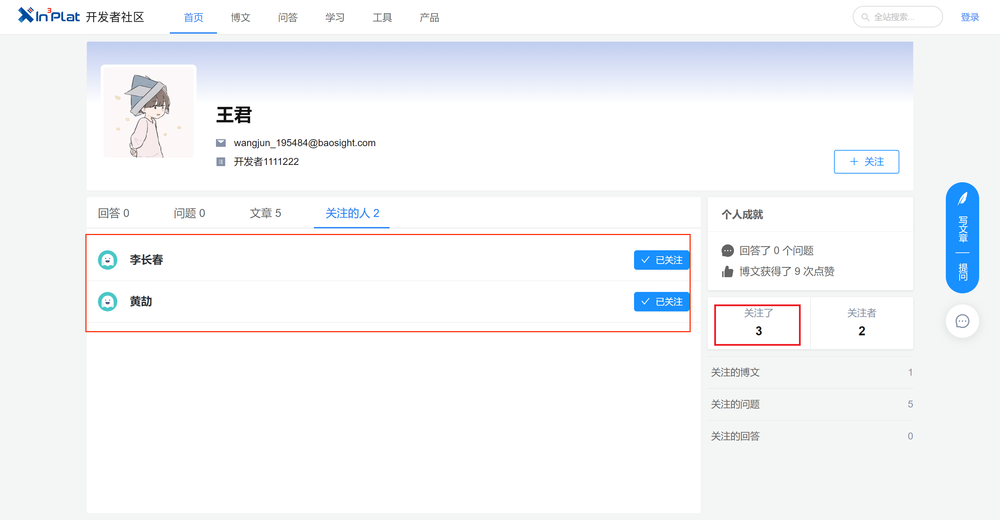

# sql相关

* 现象：两个接口查询出来的同一个用户关注用户数不同
  
* 错误关键代码:

```sql
SELECT t0.USER_ID     as "userId",
       t0.USER_NAME   as "userName",
       t0.LOGIN_NAME  as "loginName",
       t0.MOBILE      as "mobile",
       t0.EMAIL       as "email",
       t0.REC_CREATOR as "recCreator"
FROM DELIVERY.TBECN11 t0
-- 中间省略了不关键代码          
         left JOIN (select RES_ENAME
                    from DELIVERY.TBECN02
                    WHERE OPERATE_TYPE = '0'
                      AND USER_ID = '195484'
                      AND RES_TYPE = 'developer-user'
                    GROUP BY RES_ENAME) t7 on t7.RES_ENAME = t0.USER_ID
WHERE 1 = 1
ORDER BY t0.REC_CREATE_TIME desc

```

* 原因分析：
  有一些统一认证的用户信息是不存在TBECN11里面的，如果使用left join会造成t7的数据丢失，最终结果会舍弃TBECN11里面没有的
* 调整方法：
  t7 用right join关联，则会查出左表没有的数据

* 调整后sql:

```sql
SELECT (case when t0.USER_ID is not null then t0.USER_ID else t7.RES_ENAME end) as "userId",
       t0.USER_NAME                                                             as "userName",
       t0.LOGIN_NAME                                                            as "loginName",
       t0.MOBILE                                                                as "mobile",
       t0.EMAIL                                                                 as "email",
       t0.REC_CREATOR                                                           as "recCreator"
FROM DELIVERY.TBECN11 t0
-- 中间省略了不关键代码          
         right JOIN (select RES_ENAME
                     from DELIVERY.TBECN02
                     WHERE OPERATE_TYPE = '0'
                       AND USER_ID = '195484'
                       AND RES_TYPE = 'developer-user'
                     GROUP BY RES_ENAME) t7 on t7.RES_ENAME = t0.USER_ID
WHERE 1 = 1
ORDER BY t0.REC_CREATE_TIME desc
```

